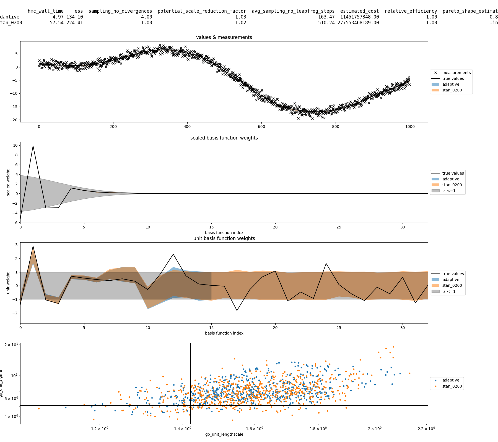
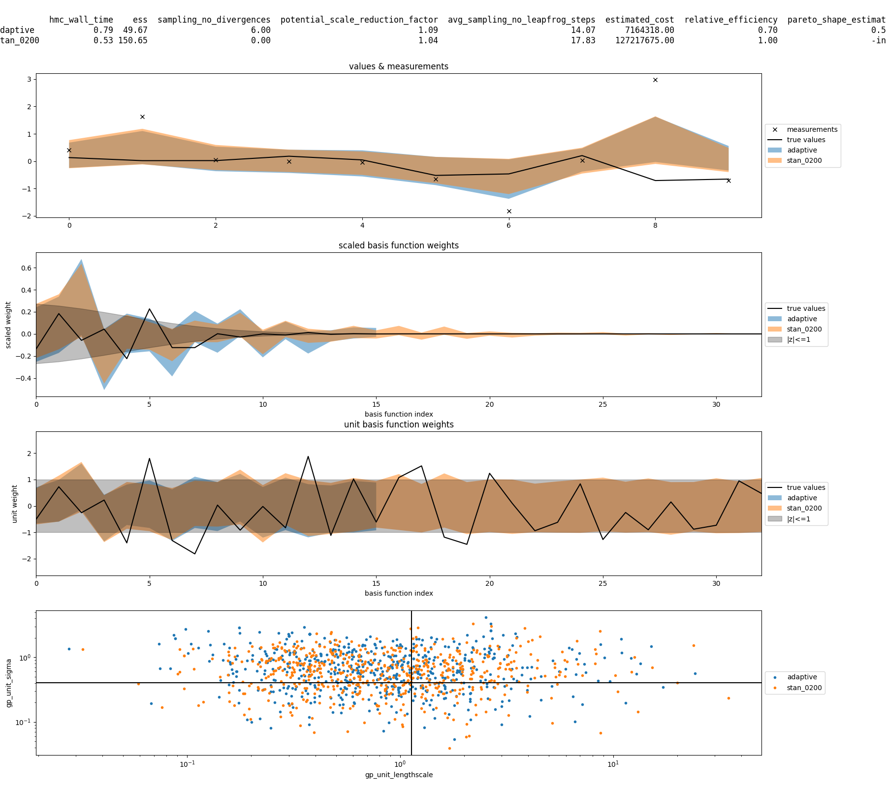
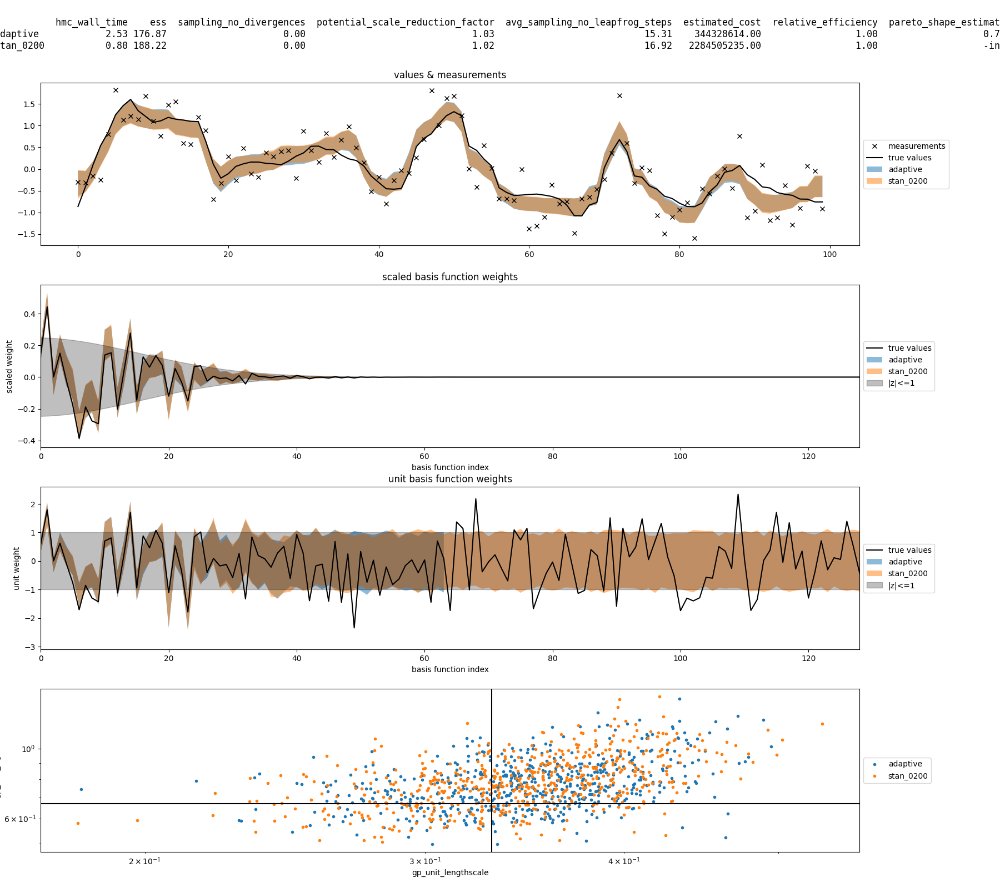

# 1D Gaussian process


As before, the plots show some diagnostics in a table at the top.
Then, from top to bottom we show

* measurements and underlying states,
* the scaled basis function weights,
* the unit basis function weights and
* a pair-plot of the Gaussian process length scale and marginal standard deviation.

Black generally corresponds to the true values, i.e.

* the measurements,
* the latent states,
* the true basis function weights and
* the true values of the Gaussian process length scale and "sigma".

In the second and third row, the shaded gray area corresponds to 0 +/- SD, where the
standard deviations of the scaled weights depends on the index of the basis
function weight and uses the "actual" Gaussian process length scale and sigma.

For the `strongly_informative` configuration, the data are so informative that
the basis function coefficients are very well determined and a centered parametrization
would have been more appropriate. For the `informative` or `weakly_informative`
configuration, this is less clear.

[^1]: forgot the correct name for this.




### Commented `.stan` code ([`examples/stan/1d_gp.stan`](stan/1d_gp.stan))
We implement a simple Gaussian process (GP) regression using an approximate series expansion
of the covariance function as proposed in [SS2020] and picked up in [RM2020].
We loosely follow the code accompanying https://avehtari.github.io/casestudies/Birthdays/birthdays.html
as accessible via https://github.com/avehtari/casestudies/tree/master/Birthdays
and closely follow the notation in [R2020].

To estimate the noisily measured values of a
scalar function f: (-1, +1) -> reals
given a GP prior with a squared exponential covariance function
of unknown
lengthscale l (`gp_lengthscale`)
and unknown
marginal standard deviation sigma, (`gp_unit_sigma * gp_sigma_multiplier`),
we approximate the
latent values f(xi) (`y_computed`)
at the
measurement points xi (`xi_observed`)
using a truncated series expansion
f(xi) = phi_j(xi) * w_j
with m
basis functions phi_j
and m
basis function coefficients w_j (`scaled_weights`),
where summation over the repeated
index j = 1,...,m
is implied.

As the
number of basis functions m (`no_basis_functions`)
increases, our approximation is supposed to converge rapidly towards the corresponding
exact GP model. While the basis functions are normalized, the prior on the
basis function coefficients rapdily decays (with the index of the basis function)
towards a point mass at zero.

[SS2020]: [Solin and Särkkä (2020)](https://link.springer.com/article/10.1007/s11222-019-09886-w)
[R2020]: [Riutort-Mayol et al. (2020)](https://arxiv.org/abs/2004.11408)

```stan
functions {
  // Returns a vector [1,...N]';
  vector range(int N){
    return linspaced_vector(N, 1, N);
  }
  // The square root of the eigenvalues.
  vector eq_sqrt_lambdaf(int no_basis_functions){
    return range(no_basis_functions)*pi()/2;
  }
  // The precomputable part of the matrix mapping the unit scale weights
  // onto the scaled basis function weights.
  matrix eq_phif(vector xi, int no_basis_functions){
    return sin(
      diag_post_multiply(
        rep_matrix(1+xi, no_basis_functions),
        eq_sqrt_lambdaf(no_basis_functions)
      )
    );
  }
  // The square root of the spectral density evaluated at the square root of the eigenvalues,
  // for the first `no_basis_functions` eigenvalues, given a `lengthscale`.
  vector eq_unit_sqrt_spectral_densityf(real lengthscale, int no_basis_functions){
    return sqrt(
      sqrt(2*pi()) * lengthscale
    ) * exp(-square(lengthscale*eq_sqrt_lambdaf(no_basis_functions))/4);
  }
}
data {
  // These are our observational data.
  int no_observations;
  vector<lower=-1,upper=1>[no_observations] xi_observed;
  vector[no_observations] y_observed;
  // To make our model more flexible, we allow a multiplier for the
  // Gaussian process lengthscale and sigma.
  real gp_lengthscale_multiplier;
  real gp_sigma_multiplier;
  // These are the configuration options for the basis function expansion
  // of the Gaussian process.
  real gp_support_fraction;
  int gp_no_basis_functions;
  // Simple flag to turn the likelihood on or off.
  // Needed for the adaptive refinement.
  real likelihood;
}
transformed data {
  matrix[no_observations, gp_no_basis_functions] gp_phi = eq_phif(
    gp_support_fraction * xi_observed, gp_no_basis_functions
  );
}
parameters {
  // To make things potentially easier for Stan,
  // we choose the parametrization such that the parameters have a standard normal
  // prior on their unconstrained scale.
  real<lower=0> sigma;
  real<lower=0> gp_unit_lengthscale;
  real<lower=0> gp_unit_sigma;
  // For more efficient posterior exploration, we might have to tune the "centeredness"
  // of our parametrization. For now and for the sake of ease of implementation,
  // we use a fixed non-centered parametrization.
  vector[gp_no_basis_functions] gp_unit_weights;
}
transformed parameters {
  real gp_lengthscale = gp_unit_lengthscale * gp_lengthscale_multiplier;
  real gp_sigma = gp_unit_sigma * gp_sigma_multiplier;
  vector[gp_no_basis_functions] gp_scaled_weights_sigma = gp_sigma
    * eq_unit_sqrt_spectral_densityf(
      2 * gp_support_fraction * gp_lengthscale,
      gp_no_basis_functions
    );
  vector[gp_no_basis_functions] gp_scaled_weights = gp_scaled_weights_sigma .* gp_unit_weights;
}
model {
  // Priors:
  // As mentioned before, these correspond to standard normal priors on the unconstrained scale.
  sigma ~ lognormal(0, 1);
  gp_unit_lengthscale ~ lognormal(0, 1);
  gp_unit_sigma ~ lognormal(0, 1);
  // "Non-centered" parametrization
  gp_unit_weights ~ normal(0, 1);
  // Likelihood:
  if(likelihood){
    // This is just y ~ normal(gp_phi * scaled_weights, sigma);
    // Allegedly this is more efficient than first computing `y_computed` as done below.
    y_observed ~ normal_id_glm(gp_phi, 0, gp_scaled_weights, sigma);
  }
}
generated quantities {
  // Recover the "true" latent values.
  vector[no_observations] y_computed = gp_phi * gp_scaled_weights;
  // Generate observations.
  vector[no_observations] y_generated = to_vector(normal_rng(y_computed, sigma));
}
```

### Commented `.py` code ([`examples/py/1d_gp.py`](py/1d_gp.py))


Please see [`linear_ode.md`](linear_ode.md) for initialization documentation.

```py
from xstanpy.incremental import *
from xstanpy.plot import *

os.environ['CMDSTAN'] = '../cmdstan'
```

While the following looks identical to the [`linear_ode.md`](linear_ode.md) example,
under the hood there is one important difference. While for the linear ODE
example the dimensionality of the posterior was independent of the
`slice_variables` or the `refinement_variable`, for the Gaussian process model
the value of `gp_no_basis_functions` influences the dimensionality of the posterior.
This does not affect Stan's regular warm-up/sampling or the [`Incremental`](../xstanpy/incremental.py#L86) warm-up,
but it forces us to change the [`Adaptive`](../xstanpy/incremental.py#L168) warm-up.
**Currently, the below only works because there is some
[prolongation](https://en.wikipedia.org/wiki/Multigrid_method) happening
under the hood. For almost any other model, simply specifying a data variable
which infuences the dimensionality of the posterior as the `refinement_variable`
will not work!**
```py
model = Model(
    'stan/1d_gp.stan',
    slice_variables={'no_observations': ('xi_observed', 'y_observed')},
    refinement_variable='gp_no_basis_functions'
)
model.compilation_process.debug()
```

There are two main obstacles to be able to use the [`Adaptive`](../xstanpy/incremental.py#L168) warm-up to reconfigure
posteriors for which refinement of the used approximation increases the dimensionality
of the approximate posterior:

* First, we have to be able to take draws from the lower dimensional posterior
and "prolongate" them onto the higher dimensional posterior.
* Second, to be able to do PSIS, we have to figure out what the appropriate
(log) posterior density of these prolongated draws is.

For the prolongation, there are several options, but two appear to me most plausible
in the current setting:

* Fill the values of the "extra" basis function weights with zero or
* fill the values of the "extra" basis function weights with draws from the prior.

If we fill the extra values with zero, then the states of the Gaussian process
will stay the same after prolongation. If on the other hand we fill the extra
values with draws from the prior, the states of the Gaussian process will generally
not stay the same.

While the first option may sound reasonable, it is the wrong choice[^2]
in this setting because the raw IS-weights passed to PSIS would all be identical.
For the second option on the other hand we can reinterpret the draws from the lower
dimensional posterior to stem from a model in the higher dimensional posterior
where the **basis functions** of the new **basis function weights** are identically zero.
**The IS-weights are then fully determined by the likelihood.**

Implementation wise, the following happens currently:

* The class [`Adaptive`](../xstanpy/incremental.py#L168) calls the function [`Adaptive.data_reconfiguration`](../xstanpy/incremental.py#L189) for each
intermediate posterior.
* There, [`DrawsPool.psis`](../xstanpy/base.py#L990) gets called.
* This passes the prolongation bucket
via [`DrawsPool.draws_for`](../xstanpy/base.py#L986) and [`PosteriorDraws.draws_for`](../xstanpy/base.py#L452) to [`Model.draws_for`](../xstanpy/base.py#L194).
* There, if the posteriors have the same dimensionality, nothing special happens.
If however the dimensionality of the target posterior is larger than the dimensionality
of the source posterior, the unconstrained parameter values get padded with draws
from a standard normal. **This is very non-portable and has to be changed. For
the current model this works because only the dimensionality of the `unit_weights`
change, which in fact have a standard normal prior.**
* Back in [`DrawsPool.psis`](../xstanpy/base.py#L990), the prolongated draws are used to compute the
log-likelihood difference.
* The only extra work happens in [`HMC.adaptation_for`](../xstanpy/base.py#L1107) via [`HMC.pooled_metric_for`](../xstanpy/base.py#L1082),
where the metric from the lower dimensional posterior gets extended by an identity
matrix in the new part of the diagonal. **This is of course also not portable**.

[^2]: Or maybe not?

What follows now is equivalent to what happens for the [`linear_ode.md`](linear_ode.md) example, with the
only difference that different configurations have a different number of observations
instead of a different number of (ODE) states.
```py
configs = dict(
    weakly_informative=10,
    informative=100,
    strongly_informative=1000,
    incredibly_informative=10000,
)
for config_name, no_observations in configs.items():
    np.random.seed(0)
    config = Data(dict(no_observations=no_observations), name=config_name)
    x_observed = np.cumsum(np.random.uniform(size=no_observations))
    x_observed = x_observed / x_observed[-1]
    xi_observed = 2 * x_observed - 1

    prior_data = dict(
        no_observations=no_observations,
        xi_observed=xi_observed,
        y_observed=np.zeros(no_observations),
        # Make data more interesting
        gp_lengthscale_multiplier=.1,
        gp_sigma_multiplier=1,
        gp_support_fraction=5/6,
        gp_no_basis_functions=256,
        likelihood=0
    )
    prior = Posterior(model, prior_data)
    prior_fit = HMC.stan_regular(prior, warmup_no_draws=100, sampling_no_draws=100)
    for idx in np.random.choice(len(prior_fit.samples.gp_unit_lengthscale.array), size=3):
        posterior = prior.updated(dict(
            y_observed=prior_fit.samples.y_generated.array[idx],
            likelihood=1
        ))
```

This again looks deceptively similar to what is done for the linear ODE example,
**While with the proper preparation the call signature should stay the same,
this preparation generally still has to happen in a custom [`Model`](../xstanpy/base.py#L146) subclass.**
```py
        adaptive = Adaptive(
            posterior,
            callback=lambda sequence: print(sequence[-1].posterior.integer_data),
        )
```

This is again just the same as for the linear ODE example.

```py
        fits = {
            'adaptive': adaptive,
        }
        # To lower the runtime we only look at the following configuration
        for warmup_no_draws in [200]:
            key = f'{warmup_no_draws:04d}'
            fits[f'stan_{key}'] = HMC.stan_regular(
                posterior,
                warmup_no_draws=warmup_no_draws,
                sampling_no_draws=100
            )
        df = pd.DataFrame({
            name: fit.information for name, fit in fits.items()
        }).T.fillna(dict(relative_efficiency=1, pareto_shape_estimate=-np.inf))
        suptitle = df.to_string(float_format='{:.2f}'.format)
        print(suptitle)
        Figure([
            [
                Ax([
                    LinePlot(prior_fit.samples.y_generated.array[idx], color='black', marker='x', linestyle='', label='measurements'),
                ] + [
                    FillPlot(fit.samples.y_computed.array, alpha=.5, label=key)
                    for key, fit in fits.items()
                ] + [
                    LinePlot(prior_fit.samples.y_computed.array[idx], color='black', label='true values'),
                ],
                    title='values & measurements',
                    show_legend=False
                )
            ],
            [
                Ax([
                    FillPlot(fit.samples.gp_scaled_weights.array, alpha=.5, label=key)
                    for key, fit in fits.items()
                ] + [
                    FillPlot([
                        -prior_fit.samples.gp_scaled_weights_sigma.array[idx],
                        prior_fit.samples.gp_scaled_weights_sigma.array[idx]
                    ], alpha=.25, color='black', label='|z|<=1'),
                    LinePlot(prior_fit.samples.gp_scaled_weights.array[idx], color='black', label='true values'),
                ],
                    title='scaled basis function weights',
                    xlabel='basis function index',
                    ylabel='scaled weight',
                    xlim=[0, 2*adaptive.sequence[-1].posterior.data['gp_no_basis_functions']],
                    show_legend=False
                )
            ],
            [
                Ax([
                    FillPlot(fit.samples.gp_unit_weights.array, alpha=.5, label=key)
                    for key, fit in fits.items()
                ] + [
                    FillPlot([
                        -1-0*prior_fit.samples.gp_scaled_weights_sigma.array[idx],
                        +1+0*prior_fit.samples.gp_scaled_weights_sigma.array[idx]
                    ], alpha=.25, color='black', label='|z|<=1'),
                    LinePlot(prior_fit.samples.gp_unit_weights.array[idx], color='black', label='true values'),
                ],
                    title='unit basis function weights',
                    xlabel='basis function index',
                    ylabel='unit weight',
                    xlim=[0, 2*adaptive.sequence[-1].posterior.data['gp_no_basis_functions']],
                    show_legend=False
                )
            ],
            [
                Ax([
                    ScatterPlot(
                        fit.samples.gp_unit_lengthscale.array,
                        fit.samples.gp_unit_sigma.array,
                        label=key
                    )
                    for key, fit in fits.items()
                ] + [
                    VerticalLine(
                        prior_fit.samples.gp_unit_lengthscale.array[idx], color='black'
                    ),
                    HorizontalLine(
                        prior_fit.samples.gp_unit_sigma.array[idx], color='black'
                    )
                ],
                    xlabel='gp_unit_lengthscale', ylabel='gp_unit_sigma',
                    xscale='log', yscale='log')
            ]
        ],
            col_width=16,
            suptitle=suptitle,
            suptitle_family='monospace',
            show_legend='row'
        ).save(
            f'figs/{model.name}/{config.name}/{posterior.hash}.png'
        )
```

## Sample output

### weakly_informative


### informative


### strongly_informative
