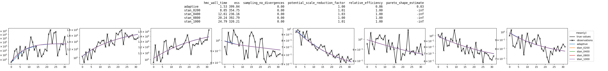

# Linear ODE

A sample visualization for a medium sized configuration (a linear ODE with 8 states)
can be seen here:


The table at the top of the figure compares among other things HMC wall times
(my current implementation has additional overhead due to the extra I/O needed e.g. for PSIS).
The plots show measurements, true ODE states and mean posterior ODE-states.

`adaptive` uses PSIS to adaptively refine an approximate solution to the ODE
while `stan_xxxx` just uses the "exact" solution
(obtained via one matrix exponential per time step).
`xxxx` corresponds to the total number of warm-up iterations.
The model itself only has two parameters (the ODE matrix is fixed), a time scale
parameter and a measurement noise parameter.


### Commented `.stan` code ([`examples/stan/linear_ode.stan`](stan/linear_ode.stan))


```stan
functions {
  array[] vector exact_y(
      array[] real x_observed, matrix k_ode_matrix
    ){
    int no_observations = size(x_observed);
    int no_dimensions = rows(k_ode_matrix);
    array[no_observations] vector[no_dimensions] y_computed;
    real t = 0;
    vector[no_dimensions] y = rep_vector(1., no_dimensions);
    for(i in 1:no_observations){
      real dt = x_observed[i] - t;
      t += dt;
      y = matrix_exp(dt * k_ode_matrix) * y;
      y_computed[i] = y;
    }
    return y_computed;
  }

  array[] vector approximate_y(
      int no_steps, array[] real x_observed, matrix k_ode_matrix
    ){
    int no_observations = size(x_observed);
    int no_dimensions = rows(k_ode_matrix);
    array[no_observations] vector[no_dimensions] y_computed;
    real dt = x_observed[no_observations] / no_steps;
    real t = 0;
    vector[no_dimensions] last_y = rep_vector(1., no_dimensions);
    vector[no_dimensions] y = last_y;
    matrix[no_dimensions, no_dimensions] factor = matrix_exp(dt * k_ode_matrix);
    for(i in 1:no_observations){
      while(t < x_observed[i]){
        t += dt;
        last_y = y;
        y = factor * y;
      }
      real xi = (x_observed[i] - (t - dt)) / dt;
      y_computed[i] = (1 - xi) * last_y + xi * y;
    }
    return y_computed;
  }
  array[] vector compute_y(
      int no_steps, array[] real x_observed, matrix k_ode_matrix
    ){
      if(no_steps == 0){
        return exact_y(x_observed, k_ode_matrix);
      }else{
        return approximate_y(no_steps, x_observed, k_ode_matrix);
      }
    }
}
data {
  int no_observations;
  int no_dimensions;
  array[no_observations] real x_observed;
  matrix[no_dimensions, no_dimensions] ode_matrix;
  array[no_observations] vector[no_dimensions] y_observed;

  int no_steps;
  real likelihood;
}
parameters {
  real<lower=0> k;
  real<lower=0> sigma;
}
transformed parameters {
  array[no_observations] vector[no_dimensions] y_computed = compute_y(
    no_steps, x_observed, k * ode_matrix
  );
}
model {
  k ~ lognormal(0,1);
  sigma ~ lognormal(-1,1);
  if(likelihood){
    for(observation_idx in 1:no_observations){
      y_observed[observation_idx] ~ lognormal(log(y_computed[observation_idx]), sigma);
    }

  }
}
generated quantities {
  array[no_observations] vector[no_dimensions] y_generated;
  for(observation_idx in 1:no_observations){
    y_generated[observation_idx] = to_vector(
      lognormal_rng(log(y_computed[observation_idx]), sigma)
    );
  }
}
```

### Commented `.py` code ([`examples/py/linear_ode.py`](py/linear_ode.py))


```py
# Needed for adaptive warm-up
from xstanpy.incremental import *
# Needed for plotting
from xstanpy.plot import *

# For proper compilation, $CMDSTAN has to point to our modified cmdstan version.
os.environ['CMDSTAN'] = '../cmdstan'
```

A [`Model`](../xstanpy/base.py#L166) object takes care of compilation and stores additional information about
the model, e.g.
* how to slice its data for use by [`Incremental`](../xstanpy/incremental.py#L86) objects via their
[`Incremental.slice_update`](../xstanpy/incremental.py#L106) and [`Incremental.data_reconfiguration`](../xstanpy/incremental.py#L122) methods
* and how to refine a posterior's approximation via [`Adaptive`](../xstanpy/incremental.py#L168) objects using their
[`Adaptive.refinement_update`](../xstanpy/incremental.py#L176) and their adapted [`Adaptive.data_reconfiguration`](../xstanpy/incremental.py#L189) methods.

The models [`Model.compilation_process`](../xstanpy/base.py#L190) is a [`Command`](../xstanpy/base.py#L120) object which handles
communication with the spawned subprocess. Its [`Command.debug`](../xstanpy/base.py#L151) method
raises an error if the process has a non-zero returncode.
```py
model = Model(
    'stan/linear_ode.stan',
    # The "incremental" part of the warm-up incrementally doubles the data
    # that we condition on by successively doubling the (integer) values
    # of the keys of the `slice_variables` dictionary and
    # slicing along the first axis of the corresponding values.
    slice_variables={'no_observations': ('x_observed', 'y_observed')},
    # The "adaptive"  part of the warm-up doubles the specified `refinement_variable`
    # until the pareto smoothed estimate of the relative efficiency of the importance sampling
    # is above the threshold `relative_efficiency_goal` (default: .5)
    refinement_variable='no_steps'
)
# This raises an error if model compilation fails and prints stdout and stderr.
model.compilation_process.debug()
```

Our Stan model [`stan/linear_ode.stan`](stan/linear_ode.stan) solves a linear ordinary differential equation
u'(t) = A u(t)
with a prespecified matrix A and assumes lognormal measurement,
implying that our states have to remain positive for all times.
For our tests, we will generate random matrices.
To ensure positivity of the ODE states, we restrict our random matrices
to have only non-negative off-diagonal entries.
Furthermore, as a simple sufficient condition for the existence of a well-behaved
stable steady state we restrict the columns to sum to zero, which enforces something
akin to mass conservation.
```py
def random_flow_matrix(no_dimensions):
    rv = np.random.lognormal(size=(no_dimensions, no_dimensions))
    rv -= np.diag(np.diag(rv))
    rv -= np.diag(np.sum(rv, axis=0))
    return rv
```

We are interested in how the two approaches scale with the size of the system[^1].
For this we look at systems with 2, 4, or 8 states. As we increase the number of states,
the cost of each matrix exponential grows (cubically?)
and begins to dominate the overall computational cost,
such that our adaptive approximate approach quickly overtakes Stan's regular warm-up,
if the latter uses the "exact" solution approach.

Running tests for larger systems takes a little bit longer, which is why we do not
do this here.

[^1]: Slightly more honestly, my approach performs worse than Stan's defaults
for small systems, which if left to stand alone would make for a bad first impression.
I *think* due to the low-dimensionality of the posterior, Stan's default works well
and my warm-up introduces quite some overhead. The situation should be different for
higher-dimensional and geometrically more challenging posteriors.
```py
configs = dict(
    smaller=2,
    small=4,
    medium=8,
    # large=16,
    # larger=32
)
# We'll keep the number of observations constant
no_observations = 16
# For equidistant measurements computing a single matrix exponential and
# then reusing it at every step would be "exact", so we change it up a bit.
# x_observed will be a series of somewhat randomly increasing positive reals
# with the last value equal to one.
x_observed = np.cumsum(np.random.uniform(size=no_observations))
x_observed = x_observed / x_observed[-1]
# We save the fit information for all configurations in this DataFrame
full_df = pd.DataFrame()
# Loop over all configurations
for config_name, no_dimensions in configs.items():
    # Allows us to access {config.name}
    config = Data(dict(no_dimensions=no_dimensions), name=config_name)
    # Set seed to zero for each configuration for reproducibility
    np.random.seed(0)
    # We save the fit information for the current configuration in this DataFrame
    config_df = pd.DataFrame()
    # These are just the data that are passed to the prior sampling
    prior_data = dict(
        no_observations=no_observations,
        no_dimensions=no_dimensions,
        # scale our observation times by the number of ODE states, as larger
        # systems tend to approach equilibrium quicker
        x_observed=x_observed,
        # One randomly generated matrix per configuration
        ode_matrix=random_flow_matrix(no_dimensions),
        # `y_observed` is irrelevant for prior sampling
        y_observed=np.zeros((no_observations, no_dimensions)),
        # no_steps = 0 means always use matrix exponentials, i.e. the "exact" solution
        no_steps=0,
        # To sample from the prior we have to turn off the likelihood
        likelihood=0
    )
```

A [`Posterior`](../xstanpy/base.py#L269) object is defined by specifying a [`Model`](../xstanpy/base.py#L166) object and
a `dict` of data. The [`Posterior`](../xstanpy/base.py#L269) object handles metadata such as
* [`Posterior.constrained_parameter_names`](../xstanpy/base.py#L283): the names of the constrained parameters,
* [`Posterior.no_constrained_parameters`](../xstanpy/base.py#L299): the number of constrained parameters,
* [`Posterior.no_unconstrained_parameters`](../xstanpy/base.py#L303): the number of *unconstrained* parameters and
* [`Posterior.column_info`](../xstanpy/base.py#L307): parameterwise slice and shape data for easy access of properly reshaped
objects
```py
    prior = Posterior(model, prior_data)
```

An [`HMC`](../xstanpy/base.py#L1021) object saves the CmdStan's `sample` method output for several chains (default: 6).
Among other thing it handles spawning several subproccess, accessible either via
* [`HMC.raw_commands`](../xstanpy/base.py#L1054), if one wants more fine grained control, e.g. to specify a timeout, or
* [`HMC.commands`](../xstanpy/base.py#L1057), which if accessed waits for all processes to finish and raises an error
if any of the subprocesses encountered an error.

The [`HMC`](../xstanpy/base.py#L1021) class provides several other convenience functions, such as
* [`HMC.samples`](../xstanpy/base.py#L1067) to access an object's SAMPLES (excluding WARM-UP draws),
* [`HMC.draws`](../xstanpy/base.py#L1064) to access an object's draws (INCLUDING warm-up draws)
* [`HMC.stan_regular`](../xstanpy/base.py#L1159) calls CmdStan's `sample` method with Stan's default arguments
```py
    prior_fit = HMC.stan_regular(prior, warmup_no_draws=100, sampling_no_draws=100)
```

Both an [`HMC`](../xstanpy/base.py#L1021) object's [`HMC.samples`](../xstanpy/base.py#L1067) and [`HMC.draws`](../xstanpy/base.py#L1064) properties
return [`DrawsPool`](../xstanpy/base.py#L986) objects, which allow for some convenience functionalities.
They allow for intuitive slicing across chains and chain properties.
This is achieved by forwarding any attribute access which fails
directly on the [`DrawsPool`](../xstanpy/base.py#L986) object to its subelements via its inherited
[`Pool.__getattr__`](../xstanpy/base.py#L873) method. In addition, [`DrawsPool`](../xstanpy/base.py#L986) objects inherit the following
convenience properties from the [`Pool`](../xstanpy/base.py#L869) class:
* [`Pool.array`](../xstanpy/base.py#L919): returns the `numpy` concatenation of the object's subelements
* [`Pool.tensor`](../xstanpy/base.py#L916): returns the result of [`Pool.array`](../xstanpy/base.py#L919) reshaped such that its first axis
has the same length as the original [`Pool`](../xstanpy/base.py#L869) object.

In practice, this enables us to e.g. access all the constrained parameter values
of the [`HMC.samples`](../xstanpy/base.py#L1067)
* via `prior_samples.constrained.array` as an `no_chains * no_draws x no_constrained_parameters`
`numpy` array or
* via `prior_samples.constrained.tensor` as an `no_chains x no_draws x no_constrained_parameters`
`numpy` array.

In addition, the same is possible for any variable defined in the
`parameters`, `transformed parameters` or `generated quantities` block.
For this model ([`stan/linear_ode.stan`](stan/linear_ode.stan)) we should be able to access e.g.
* `prior_fit.samples.k.array` (`no_chains * no_draws`),
* `prior_fit.samples.sigma.tensor` (`no_chains x no_draws`),
* `prior_fit.samples.y_computed.array` (`no_chains * no_draws x no_observations x no_dimensions`),
* `prior_fit.samples.y_generated.tensor` (`no_chains x no_draws x no_observations x no_dimensions`).
```py
    prior_samples = prior_fit.samples
    for idx in np.random.choice(len(prior_samples.constrained.array), size=2):
        y_true = prior_samples.y_computed.array[idx]
        y_observed = prior_samples.y_generated.array[idx]
        posterior = prior.updated(dict(
            y_observed=y_observed,
            likelihood=1,
            no_steps=0
        ))
        adaptive = Adaptive(
            posterior,
            callback=lambda sequence: print(sequence[-1].posterior.integer_data),
        )

        fits = {
            'adaptive': adaptive,
        }
        for warmup_no_draws in [200]:
            key = f'{warmup_no_draws:04d}'
            fits[f'stan_{key}'] = HMC.stan_regular(
                posterior,
                warmup_no_draws=warmup_no_draws,
                sampling_no_draws=100
            )
            fits[f'psis_{key}'] = HMC.stan_regular(
                adaptive.sampling.posterior,
                warmup_no_draws=warmup_no_draws,
                sampling_no_draws=100
            )

        df = pd.DataFrame({
            name: fit.information for name, fit in fits.items()
        }).T.fillna(dict(relative_efficiency=1, pareto_shape_estimate=-np.inf))

        config_df = pd.concat([config_df, pd.concat({posterior.hash: df}, names=['posterior'])])
        suptitle = df.to_string(float_format='{:.2f}'.format)
        print(suptitle)
        axes = [
            Ax([
                LinePlot(y_true[:, i], color='black', label='true values'),
                LinePlot(y_observed[:, i], marker='x', color='black', label='observations'),
            ] + [
                FillPlot(fit.samples.y_computed.array[:,:,i], alpha=.5, label=key)
                # LinePlot(np.mean(fit.samples.y_computed.array[:,:,i], axis=0), label=key)
                for key, fit in fits.items()
            ], yscale='log', show_legend=False)
            for i in range(no_dimensions)
        ]
        Figure(
            axes,
            suptitle=suptitle,
            suptitle_family='monospace',
            show_legend='row',
            legend_title='mean(y)'
        ).save(
            f'figs/{model.name}/{config.name}/{posterior.hash}.png'
        )
```

## Sample output

### large


### smaller


### small


### medium
